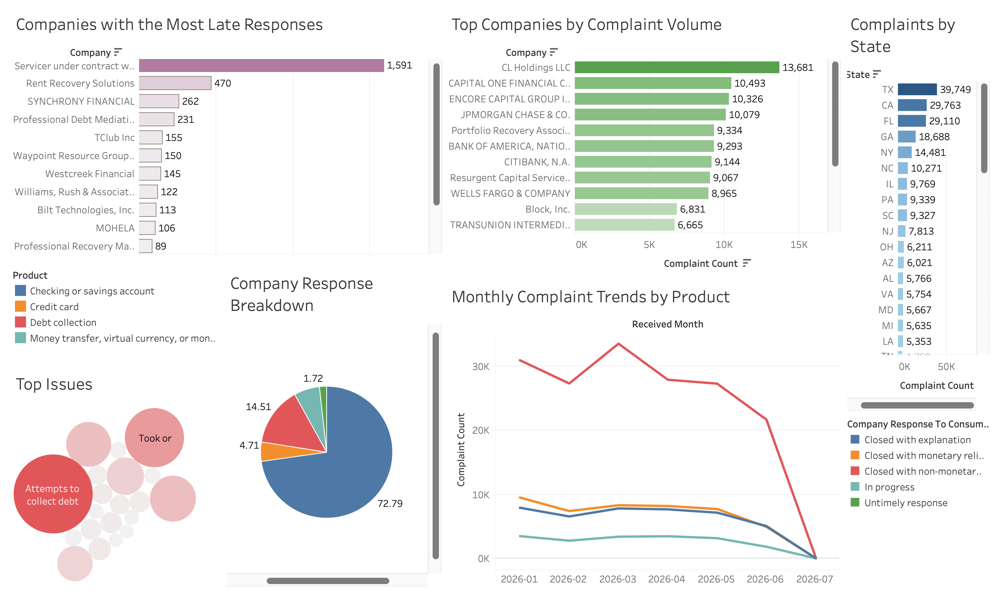

# Customer Complaint Risk Analytics

I built this project to understand what can be learned from a large volume of real consumer complaints, beyond simply counting them.

The analysis focuses on complaint trends, the companies receiving the most complaints, common customer issues, response outcomes, and where complaints are concentrated geographically.

The project covers the full analytics process, from cleaning the raw data in Python to writing SQL queries and building the final dashboard in Tableau.

## Dashboard

**Interactive Tableau dashboard:** https://public.tableau.com/views/Complaintsanalysis/Dashboard1?:language=en-GB&publish=yes&:sid=&:redirect=auth&:display_count=n&:origin=viz_share_link

## About the data

The dataset comes from the Consumer Financial Protection Bureau Consumer Complaint Database.

For this project, I analysed more than 275,000 complaints received between January and July 2026.

The analysis focuses on four product groups:

- Debt collection
- Credit cards
- Checking or savings accounts
- Money transfer, virtual currency or money services

The full dataset is not included in this repository because of its size. A smaller sample is available in the `data` folder.

## What I wanted to find out

The main questions I explored were:

- Which companies receive the highest number of complaints?
- What issues are customers reporting most often?
- How has complaint volume changed over time?
- Which products are associated with particular issues?
- Which companies record the most late responses?
- How do company response outcomes differ?
- Which states generate the highest complaint volumes?

## How I approached the project

I first cleaned and prepared the data using Python and Pandas.

This included:

- standardising column names
- checking missing values
- removing duplicates
- converting date fields
- creating month and year fields
- identifying whether a complaint included a customer narrative
- calculating how long companies took to send complaints a response
- creating a flag for timely and late responses

The cleaned data was then imported into MySQL.

I used SQL to create summary tables for:

- top companies
- top issues
- monthly complaint trends
- state-level complaints
- response outcomes
- late responses
- product and issue combinations
- company risk indicators

These summary tables were exported and used to build the Tableau dashboard.

## Main findings

A few findings stood out during the analysis:

- Debt collection generated the largest share of complaints.
- Attempts to collect debt not owed was one of the most common issues.
- Complaint volume was heavily concentrated among a relatively small number of companies.
- Texas, California and Florida recorded some of the highest complaint totals.
- Closed with explanation was the most common company response.
- Some companies recorded noticeably more late responses than others.
- Complaint issues varied significantly depending on the financial product.

## Tools used

- Python
- Pandas
- Google Colab
- MySQL
- MySQL Workbench
- Tableau Public
- Git
- GitHub
